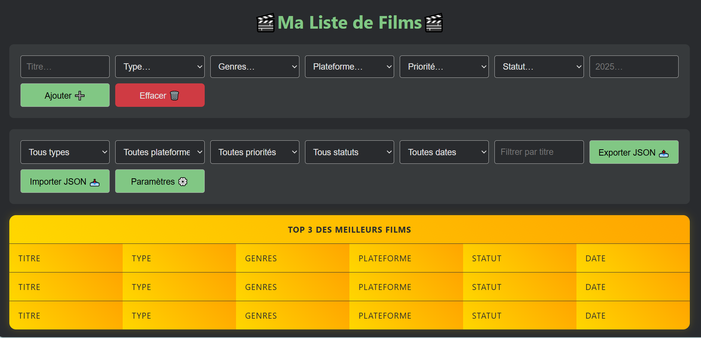
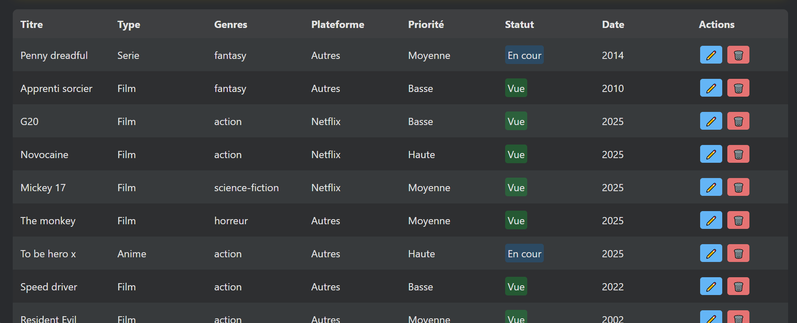

# 🎬 Ma Liste de Films, Séries & Animes

Une application web minimaliste et rapide qui vous permet de **gérer les films, séries et animes que vous avez vus, que vous êtes en train de regarder ou que vous souhaitez découvrir**.

> 📌 *Optimisée pour une utilisation sur ordinateur (version mobile en cours de réflexion).*

---

## 🚀 Fonctionnalités

- ➕ **Ajout rapide** d’un film, d’une série ou d’un anime
- ✅ **Suivi de statut** : marquer comme _Vu_, _En cours_, _À voir_ ou _Arrêté_
- 🖊️ **Modification et édition** des fiches à tout moment
- 🗑️ **Suppression** simple des médias
- 🔝 **Affichage automatique du Top 3** de vos contenus favoris
- 📎 **Filtres dynamiques** pour trier et organiser votre liste
- 💾 **Stockage local** via `localStorage` (aucune base de données externe)
- 🔔 **Notifications animées** en cas d’actions réussies ou d’erreurs
- 📊 **Statistiques visibles** : nombre total de médias, répartitions par statut
- 🎯 **Objectif personnel** : possibilité de définir un objectif hebdomadaire de visionnage
- 💡 **Suggestions de recommandations** : système interne qui propose des titres à (re)découvrir depuis vos listes
- 🌙/☀️ **Mode clair/sombre** basculable dynamiquement
- 🔐 **Sauvegarde et restauration** manuelle via fichiers `.json`

---

## 🧱 Technologies utilisées

| Langage | Utilisation |
|--------|-------------|
| 🖥️ HTML | Structure de l'application |
| 🎨 CSS | Design moderne et sombre, responsive |
| ⚙️ JavaScript (Vanilla) | Logique fonctionnelle et gestion des événements |
| 💾 localStorage | Sauvegarde locale et persistante des données utilisateur |

---

## 📂 Structure du projet

```
MyListfilm/
├── index.html         # Fichier HTML principal
├── style.css          # Feuille de style CSS (mode sombre + responsive)
├── script.js          # Logique JavaScript (ajout, édition, suppression...)
└── README.md          # Documentation du projet
```

---

## 📸 Aperçu de l'application

| Ajout / Filtres | Tableau principal |
|-----------------|-------------------|
|  |  |

---

## 🌐 Déploiement

L’application est hébergée gratuitement via **GitHub Pages**.

🔗 **[Accéder au site](https://arthursongwa.github.io/MyListfilm/)**

> ✨ Aucune inscription requise – vos données sont stockées localement dans votre navigateur.

---

## ⚙️ Paramètres intégrés

La modale "Paramètres" permet de :
- 🎨 Changer de thème clair/sombre
- 💾 Définir un nom de fichier pour les sauvegardes
- 📥 Importer/Exporter ses données
- 🧼 Réinitialiser toutes les données
- 📊 Voir des statistiques globales sur les médias suivis
- 🎯 Définir un objectif de visionnage hebdomadaire

---

## 🧑‍💻 Auteur

**Arthur Songwa-Nkuiga**  
📧 [arthursongwa@gmail.com](mailto:arthursongwa@gmail.com)  
📍 Étudiant en ingénierie (Polytech Tours) & passionné par le web et le cinéma

---

## 🙌 Remerciements

Merci à tous ceux qui testent, donnent leur avis ou proposent des améliorations 🙏
